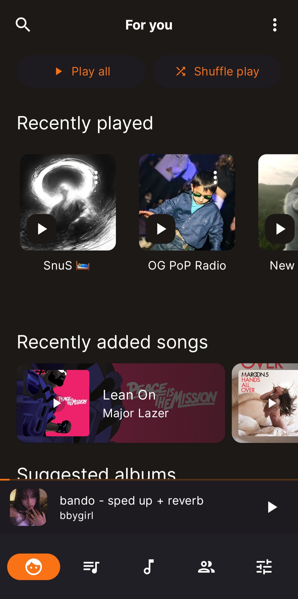
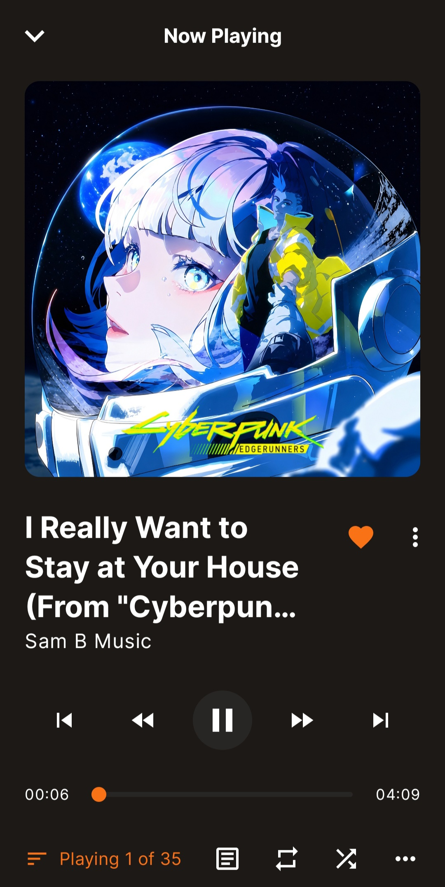
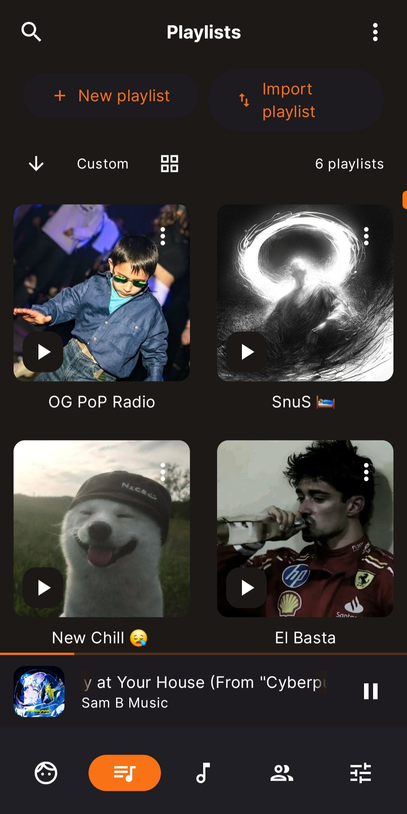
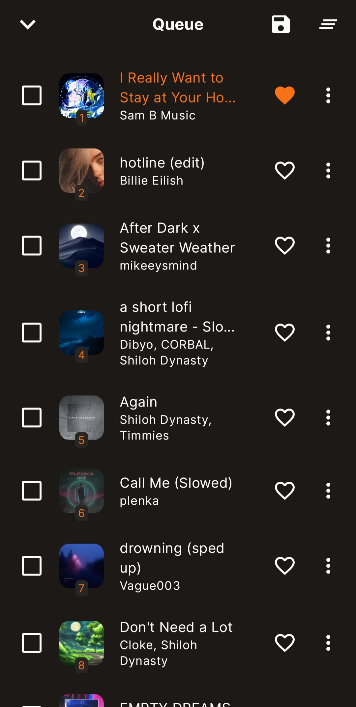

<div align="center">


**Offline music for your phone — and for your car.**

[](./LICENSE)
[](#requirements)
[](https://github.com/ixPansi/Mazika/releases/latest)
[](https://developer.android.com/jetpack/compose)

</div>

> MAZIKA is an independent fork of [Symphony](https://github.com/zyrouge/symphony) by
> Zyrouge, **modified by ixPansi in 2026** to add Android Auto, custom playlist and song
> covers, a Recently played row, rewritten drag-to-reorder, theme presets with matching
> launcher icons, and configurable fades. It is **not** affiliated with or endorsed by the
> Symphony authors, and it installs alongside Symphony rather than replacing it.

---

## Why MAZIKA?

|  | Symphony | MAZIKA |
|---|---|---|
| **Android Auto** | — | Full browse tree, voice search, artwork in the queue, reorderable categories |
| **Custom playlist covers** | — | Pick, crop, replace, remove |
| **Custom song covers** | — | Same, and they survive a library rescan |
| **Recently played** | — | What you played *from* — albums, artists, playlists, folders |
| **Drag to reorder** | Queue and playlists, unreliable | Rewritten; also home tabs, For You, car categories |
| **Favourite a song** | Buried in the overflow menu | One tap on the row |
| **Theme presets** | Mode and colour, set separately | Six one-tap presets |
| **Launcher icon** | Fixed | Follows your theme |
| **Seek durations** | Forward and back shared one value | Independent (15 s / 30 s) |
| **Pause/resume fade** | Tied to track fade | Its own toggle |
| **Lyrics** | Button | Button, or swipe down the cover |
| **Opens on** | Songs | For You |

**Everything Symphony already did well is still here**: a fast Jetpack Compose interface,
a real offline library with TagLib metadata parsing, and no accounts, no analytics, no
streaming and no network access it doesn't need.

## Screenshots

| For you | Now playing | Playlist | Queue |
|---|---|---|---|
|  |  |  |  |

## What's new, in detail

<details>
<summary><b>Android Auto</b> — Symphony has none at all</summary>

- A `MediaBrowserService` sharing the phone's existing media session and playback engine,
  so a queue started in the car is the same queue on the phone.
- Browse **Songs · Albums · Artists · Playlists · Genres · Folders**, and search by voice
  or text.
- **Choose which categories appear and in what order** by dragging them
  (Settings → Android Auto). Playlists come first by default, not Songs.
- Cover art in the browse tree *and* in the queue. It is sent as content URIs rather than
  bitmaps, because a full queue of bitmaps in one parcel exceeds the binder transaction
  limit.
- Media ids carry the play context, so tapping a song builds the correct
  album/artist/playlist/genre/folder queue instead of a queue of one.
- The app can start cold in the car, with no activity, because the playback session is
  process-scoped.

</details>

<details>
<summary><b>Cover art you choose</b></summary>

- Custom covers for **playlists** and for **songs** — pick, preview, replace, remove.
  Images are EXIF-oriented, centre-cropped square, scaled to at most 1024 px and stored as
  WebP in the app's private storage. Your original gallery image is never touched.
- Song covers are keyed by **path, not id**: ids are regenerated by the library scanner
  and the songs table lives in the cache database, so an id-keyed cover would vanish on
  the next rescan.
- They appear everywhere — song rows, Now Playing, the mini player, the folder view,
  playlist tiles, the notification, the lock screen and Android Auto.
- **A new cover appears immediately**, without relaunching the app.

</details>

<details>
<summary><b>Recently played</b></summary>

- At the top of For You: the things you played *from* — playlists, albums, artists, album
  artists, genres, folders — not merely the tracks that happened to play. Each renders as
  the tile it already has elsewhere, so tapping opens it and the play button plays it.
- Recorded only once something has actually played for five seconds, so opening an album
  and backing straight out doesn't fill the row with things you never listened to.
- Ids are chosen to survive a rescan, and the list is pruned to the newest 50.

</details>

<details>
<summary><b>Reordering that works, everywhere</b></summary>

Playlists, the queue, home tabs, For You sections and the car's categories.

- Rows are tracked by **list key** rather than index, and at most one move is applied per
  layout pass. A touchscreen reports several times per drawn frame but a `LazyColumn` is
  measured once, so every event after a swap still read the pre-move layout and swapped
  again — one crossing fired three or four swaps.
- The gesture keyed its `pointerInput` on the row index, and Compose cancels a
  `pointerInput` when its key changes, so the drag died after moving a single position.
- Edge auto-scroll is one frame-driven loop at a fixed **dp per second**. It was pixels
  per *frame*, so a 120 Hz screen scrolled twice as fast as a 60 Hz one.

</details>

<details>
<summary><b>Player and appearance</b></summary>

- **Favourite toggle on the song row itself**, filled or outlined. Previously the heart
  appeared only once a song was *already* a favourite — so it was an un-favourite button
  and nothing else, and favouriting still meant opening the overflow menu.
- **Independent seek-forward and seek-back durations** (30 s / 15 s). The forward duration
  used to reuse the back duration's stored key, so changing either changed both.
- **Configurable pause/resume fade**, nested under Fade playback and separate from
  track-transition fades.
- **Swipe down on the Now Playing cover** to open lyrics; the button still works.
- **Six one-tap theme presets** — Sunset, MAZIKA Red, Midnight, Forest, Ocean, Daylight.
  Each sets theme mode and primary colour together and turns Material You off, so the
  colour you pick is the colour you get.
- **The launcher icon follows the preset.** Android can't recolour a launcher icon at
  runtime, so each preset ships its own icon variant and the app swaps between them.

</details>

## Install

Grab an APK from the [latest release](https://github.com/ixPansi/Mazika/releases/latest):

- **`mazika-v<version>-arm64-v8a.apk`** — the right choice for essentially every phone
  made in the last decade.
- **`mazika-v<version>-universal.apk`** — larger, works on anything, use it if unsure.

MAZIKA uses its own application id (`com.mazika.musicplayer`), so it installs **alongside**
Symphony rather than replacing it.

## Requirements

- **Android 9 (API 28) or later.**
- To build: JDK 17, Node.js 18+, Android SDK 35 (build-tools 35.0.0), NDK
  `27.0.12077973`, CMake `3.22.1`. The Gradle wrapper (8.10.2) fetches Gradle itself.

## Building

MAZIKA has a native module (`metaphony`, a TagLib wrapper), so the NDK/CMake and the
TagLib git submodule are required.

```bash
# 1. Fetch the native submodule (TagLib)
git submodule update --init --recursive

# 2. Install the Node tooling (used for translation generation)
npm install

# 3. Generate translation resources (REQUIRED before every build — the generated
#    files under app/src/main/assets/i18n and *.g.kt are git-ignored)
npm run prebuild

# 4a. Debug build (Windows)
gradlew.bat assembleDebug
# 4b. Debug build (Linux/macOS)
./gradlew assembleDebug
```

Point Gradle at your SDK via `local.properties` (forward slashes on Windows):

```
sdk.dir=C:/Users/<you>/Android/Sdk
```

APKs land in `app/build/outputs/apk/debug/` — one per ABI plus `app-universal-debug.apk`.

### Release build

```bash
gradlew.bat assembleRelease bundleRelease
npm run android:move-outputs   # renames output into dist/mazika-v<version>-<abi>.apk
```

Release builds are minified with R8 and signed with a keystore supplied through
environment variables — see [`SIGNING.md`](./SIGNING.md). **Without a keystore the build
produces an unsigned APK rather than failing**, so verify with `apksigner verify
--print-certs` before distributing anything.

`npm run android:move-outputs` needs `APP_VERSION_NAME` set and expects both
`assembleRelease` and `bundleRelease` to have run.

To let a locally built APK check this repository for updates, pass
`MAZIKA_GITHUB_REPOSITORY=owner/repository` as an environment variable or
`-PMAZIKA_GITHUB_REPOSITORY=owner/repository`. It defaults to `ixPansi/Mazika`; GitHub
Actions builds derive it from `GITHUB_REPOSITORY`.

## Playlist and song cover storage

Selected covers are processed (EXIF-oriented, centre-cropped square, scaled to at most
1024×1024) and stored as WebP in the app's private internal storage. Playlists store a
relative file name; song covers are keyed by path. Replacing a cover writes a new file and
deletes the old one; removing a cover or deleting a playlist deletes the file; orphans are
cleaned up on library refresh. **The original gallery image is never modified or deleted.**

## Documentation

- [`CHANGELOG.md`](./CHANGELOG.md) — what changed in MAZIKA.
- [`IMPLEMENTATION_REPORT.md`](./IMPLEMENTATION_REPORT.md) — architecture, files changed,
  migrations, tests, limitations.
- [`TESTING.md`](./TESTING.md) — manual test cases.
- [`SIGNING.md`](./SIGNING.md) — release signing.
- [`ANDROID_AUTO_TESTING.md`](./ANDROID_AUTO_TESTING.md) — testing Android Auto without a car.
- [`AGENTS.md`](./AGENTS.md) — repository guide (build commands, architecture notes).

## License

[**AGPL-3.0**](./LICENSE) — inherited from Symphony, and unchanged.

MAZIKA is free software: you may redistribute and modify it under the terms of the GNU
Affero General Public License, version 3 or later. It is distributed **without any
warranty**, without even the implied warranty of merchantability or fitness for a
particular purpose.

Based on [zyrouge/symphony](https://github.com/zyrouge/symphony), forked at commit
`dd04b872`. Upstream copyright, the fork point and the full list of modifications are
recorded in [`NOTICE`](./NOTICE), and the licence is also reachable in the app under
**Settings → About**.
